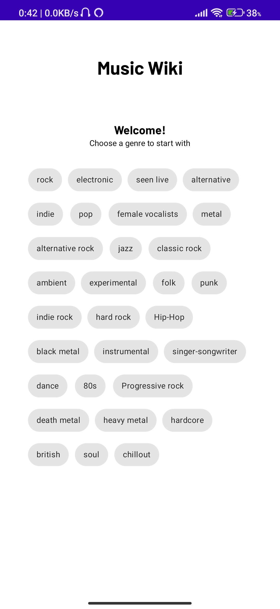
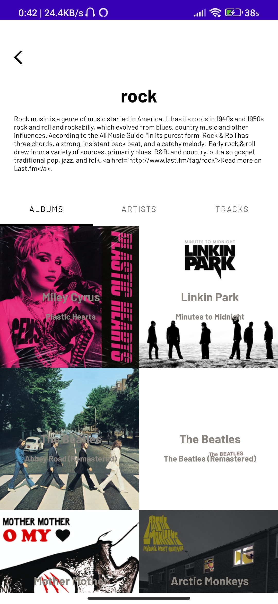
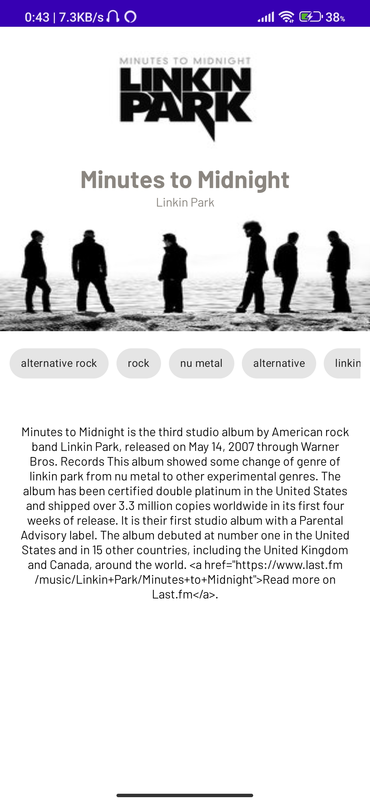
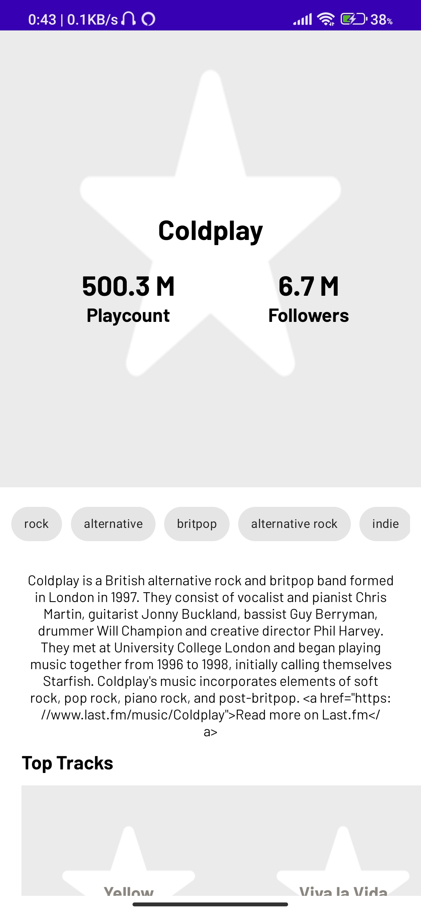

 

# Music-Wiki

 A simple app that lets you see relevant information based on music genres based on the lastFM API 

  
[Find APK here](https://github.com/Simba-97/Music-Wiki/blob/master/app-debug.apk)

---

## Music-Wiki
An Android App for viewing details of songs of different genres along with their artist and stats from the lastFM API, the application is built to show the use of MVVM clean architecture along with different architecture components in Android along with best practices. Read more about MVVM Clean architecture [here](https://developer.android.com/topic/architecture)

## **Steps to run the app**

You are requested to fork the project and then clone the forked project to your local device. Run the cloned repository with the help of Android Studio, <b>[Important]</b> The gradle is supposed to <b>fail</b> since the value of the ``API_KEY`` is not found. You should head to [Last FM API docs](https://www.last.fm/api) and follow the steps or head down to [create an account](https://www.last.fm/login?next=/api/account/create) to generate your ``API_KEY``. Replace the ``BuildConfig.API_KEY`` with your generated API_KEY and run the application.

Please find also a ``app-debug.apk`` attached in the repo. You can go ahead download the APK and get started immediately. [Please note the support for the APK might end soon. In case the downloaded APK doesn't work or if you're unable to see data with the downloaded APK, you are suggested to follow the steps above].

## **Functionality & Concepts used**

The App has a very simple and interactive design which helps user quicly look for any pictures from the imgur gallery have them  according viewed according to their layout preference(list or grid).
Following are few android concepts used to achieve the functionalities in app :

- `LastFM API` : The LastFM API is used for fetching the data from the remote server and serve it to the user using the Music-Wiki application.
- `Constraint Layout` : All of the activities in the app uses a flexible <b>Constraint Layout</b>, which is easy to handle for different screen sizes.
- `Recyclerview` :  To present the list of different images we used the efficient <b>Recyclerview</b>. 
- `LiveData` : We are also using <b>LiveData</b> to update & observe any changes to the response we receive from the LastFM API
- `Retrofit` : Used retrofit for making HTTPS requests to the LastFM API.
- `Coil` : Made use of Coil to load image url into image resources for the view of the recycler view.
- `Dagger Hilt` : Made use of Dagger Hilt for dependency injection. Dependency injection has been implemented into the project keeping in mind future aspects of the project related to scalibility and easier testing.

## **Screenshots**
 
 
## **Application Link & Future Scope**

The app is currently in the development phase. We plan to bring more features in the future which would make the app more interactive. You can access the `app by cloning the repo and replacing the ``BuildConfig.API_KEY`` with your API_KEY(Please find the instructions above).
Also we welcome, anyone who has an idea or wants to contribute to the project or just refer to the project.

### Thank You!! :)

